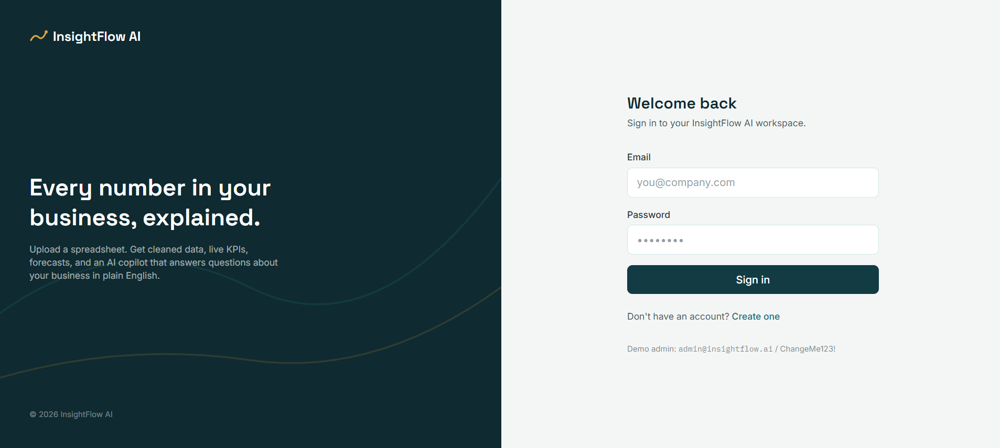
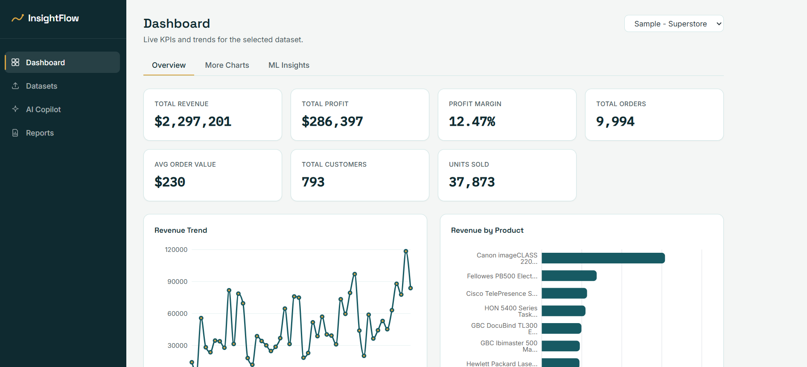
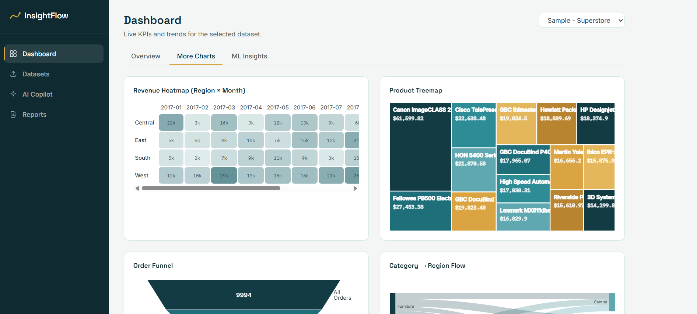
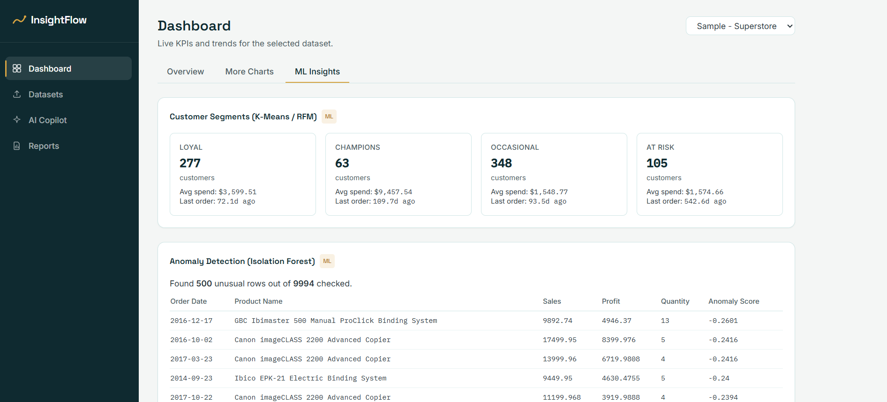
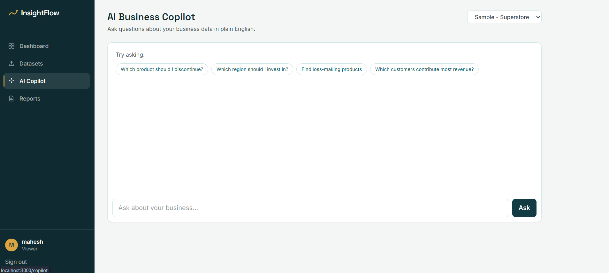
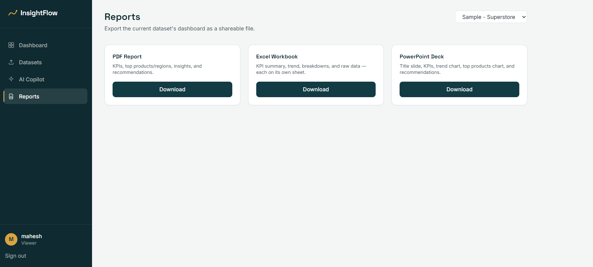

\# InsightFlow AI


InsightFlow AI is a full-stack business intelligence platform that helps users explore business data through interactive dashboards and AI-assisted analysis. The application allows users to upload datasets, monitor key business metrics, visualize trends, identify anomalies, and ask questions about their data using a local AI assistant powered by Ollama.


The project was built to combine traditional business intelligence with modern AI capabilities in a single application. Rather than switching between multiple analytics tools, users can upload a dataset once and explore it through dashboards, forecasting models, machine learning insights, and natural language conversations.


\---


\## Project Overview


The application is designed around a simple workflow.


Users upload a CSV or Excel dataset, the backend processes and cleans the data, analytics are generated automatically, and the results are presented through an interactive dashboard. The integrated AI Copilot can then answer business-related questions using the uploaded data as context.


\---


\## Features


Authentication


\- User Registration

\- Secure Login


Data Management


\- CSV Upload

\- Excel Upload

\- Automatic Data Cleaning

\- Dataset Management


Dashboard


\- KPI Cards

\- Revenue Analysis

\- Sales Trends

\- Category Analysis

\- Regional Analysis


Visualizations


\- Line Charts

\- Bar Charts

\- Pie Charts

\- Treemap

\- Heatmap

\- Sankey Diagram

\- Funnel Chart


Machine Learning


\- Customer Segmentation

\- Anomaly Detection

\- Revenue Forecasting


AI Assistant


\- Natural Language Queries

\- Business Insights

\- Recommendations

\- Local LLM Integration using Ollama


Reports


\- Downloadable Business Reports


\---


\## Technology Stack


Frontend


\- React

\- Vite

\- Tailwind CSS

\- Plotly

\- React Simple Maps


Backend


\- FastAPI

\- Python

\- SQLAlchemy

\- Pandas

\- PostgreSQL


Artificial Intelligence


\- Ollama

\- Llama 3.1


Development Tools


\- Git

\- GitHub

\- VS Code


\---


\## Project Structure


```

InsightFlowAI/


backend/

frontend/

datasets/

reports/

screenshots/

README.md

```


\---


\## Getting Started


Clone the repository


```bash

git clone https://github.com/maheshdamam/InsightFlow\_AI.git

```


Move into the project


```bash

cd InsightFlow\_AI

```


Backend


```bash

cd backend


python -m venv venv


venv\\Scripts\\activate


pip install -r requirements.txt


uvicorn app.main:app --reload

```


Frontend


```bash

cd frontend


npm install


npm run dev

```


\---


\## Application Preview

### Login



### Dashboard Overview



### Analytics Dashboard



### Machine Learning Insights



### AI Copilot



### Reports




Login Page


!\[Login](screenshots/login.png)


Dashboard Overview


!\[Dashboard](screenshots/dashboard-overview.png)


Business Analytics


!\[Charts](screenshots/dashboard-charts.png)


Machine Learning


!\[ML](screenshots/ml-insights.png)


AI Copilot


!\[Copilot](screenshots/ai-copilot.png)


Reports


!\[Reports](screenshots/download-reports.png)


\---


\## Future Improvements


Future development will focus on expanding the platform with additional enterprise capabilities, including role-based access control, real-time analytics, cloud deployment, advanced forecasting models, RAG-based document intelligence, and support for multiple database connections.


\---


\## Author


Mahesh Damam


GitHub


https://github.com/maheshdamam

